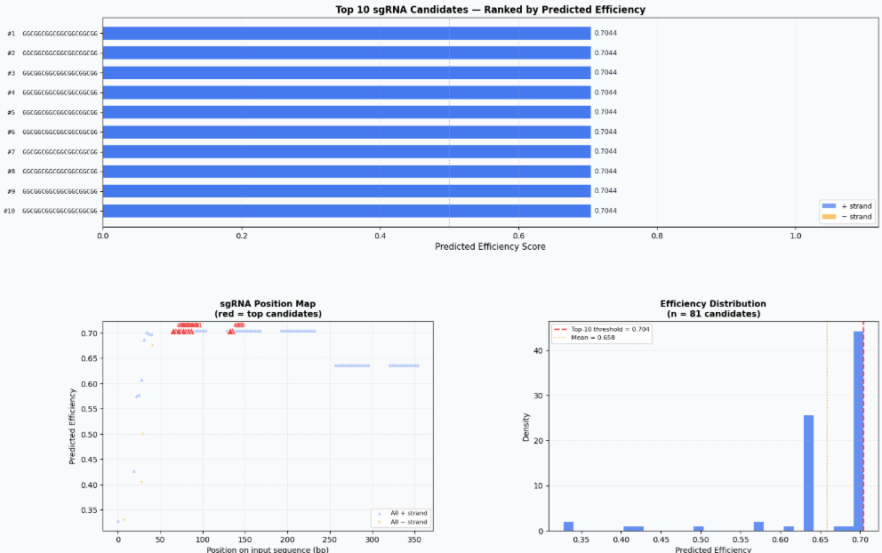
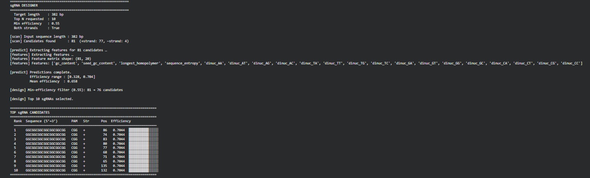
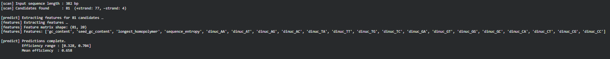

# AI-CRISPR-sgRNA-Designer
 AI-based sgRNA prediction using machine learning
# AI-CRISPR sgRNA Designer

AI-based sgRNA prediction using machine learning.

## Features
- Doench dataset based training
- Nested cross validation
- Model comparison
- External validation
- Biological sequence testing

## Models Used
- Random Forest
- XGBoost
- Gradient Boosting
- SVM

## Dataset
Doench 2016 sgRNA dataset

## Results
Best Model: Random Forest  
Performance: High accuracy on external dataset
## Results

## Top sgRNA Candidates

## Pipeline Output

## How to Run
1. Open notebook in Google Colab
2. Upload dataset
3. Run all cells

## Author
Parth Khedu
